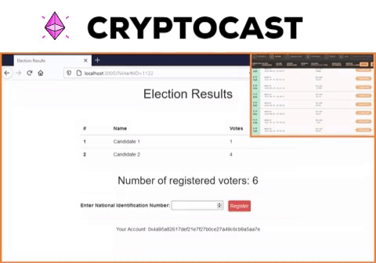

# CryptoCast - Blockchain Based Secure Voting System

## CryptoCast is Ethereum Blockchain based decentralized application which ensures secure and transparent voting scheme for organizing public and private elections.

  

## :bulb: Features
:arrow_forward:  **Secure Voter Registration**  
:arrow_forward:  **Ballot Signing Support For Election Authority**  
:arrow_forward:  **Tamper-proof Ballots**  
:arrow_forward:  **Double Voting Prevention**  
:arrow_forward:  **Blind Signature Support using ECDSA**

## 🎯 Purpose of Blockchain Based E-Voting

### Physical election systems that are prevalent have several drawbacks -
- Ballots can be internally tampered before or after vote casting
- Election system does not ensure transparency and security
- Voters need to trust election authority
- Double voting issue can occur

### CryptoCast, being a blockchain based E-Voting solution, addresses these issues by adpoting following schemes -
- Each ballot is **cryptographically signed** using election authority's *private key*
- Ballots are **tamper-proof** as those are digitally signed and verified by **smart contract** on the blockchain.
- **Double voting** is addressed by keeping registered voters' data on Blockchain
- Election authority does not have access to voter's ballot
- Elligible voters can only register for the election with their _National Identification Number_.

## :hammer: Technology Stack
1. **Blockchain Tools**
    1. [Truffle](https://www.trufflesuite.com/)
    1. [Web3 JS](https://web3js.readthedocs.io/en/v1.2.11/)
    1. [Ganache](https://www.trufflesuite.com/ganache)
1. **Smart Contract Programming**
    1. [Solidity](https://solidity.readthedocs.io/en/v0.7.0/)
1. **Front End**
    1. [HTML](https://en.wikipedia.org/wiki/HTML/)
    1. [CSS](https://www.w3.org/Style/CSS/Overview.en.html)
    1. [Bootstrap](https://getbootstrap.com/)
    1. [JavaScript](https://www.javascript.com/)
1. **Dev Servers**
    1. [Node](https://nodejs.org/en/)
    1. [Lite-Server](https://www.npmjs.com/package/lite-server)

## :briefcase: Pre-requisites

- **Truffle** `= v5.1.10`
- **Node.js** `>= v12.18.2`
- **Solidity (Solc-js)** `= v0.4.23 `
- **Node.js** `>= v12.18.2`
- **Web3** `>= v1.2.11`

## :mega: How to Build

### Step-1 : Prepare Development Environment

1. #### Install [Node JS](https://nodejs.org/en/)
    - Head into the website & download.
    - **Tip: Use NVM version manager to flexibly install NodeJS)**

2. #### Install [Truffle Smart Contract Blockchain Framework](https://github.com/trufflesuite/truffle)
    - `$ npm install -g truffle`

3. #### Install [Ganache GUI](https://www.trufflesuite.com/ganache)
    - Head into the website & download.

4. #### Clone the repository
    - Download the repo to your local machine using `$ git clone`.

5. #### Install Project Dependencies using NPM

    - Change directory into the project root by `$ cd CryptoCast/` and run `$ npm install`

6. ####  Install [MetaMax extension](https://metamask.io/)

    - Install the extension based on your preferred web browser *(Chrome/Edge/Firefox)*

7. #### Install [Solidity Syntax Highlighter Package]() (Optional)

    - Based on your favorite text editor *(Atom/Sublime Text/VSCode)*, install *Solidity Syntax Highlighter Package* to properly highlight the solidity sources.

### Step-2 : Run the Project

1. #### Compile & Test

    - Run '$ truffle compile' and make sure the source is successfully compiled.

    - Tip: Remove **'build/'** folder and then compile for generating fresh new compilation artifacts of the sources.

2. #### Fire Up Ganache

    - Open Ganace and start local blockchain workspace
    - Make sure the Ganache port ID is same as the port specified under _'development'_ network in _truffle-config.js_.
    - Copy the deployed **'contract address'** and paste it on _contractAddress_ variable on 'src/js/app.js' script

3. #### Smart Contract Migration

    - Run `$ truffle migrate --reset` and wait for successful deployment of the contracts on the local blockchain.

4. #### Start Dev Server

    - Start Lite-Server using `$ npm run dev` on project root.

### Step-3 : Interact with the Dapp

1. Open your preferred browser in `http://localhost:3000`, with MetaMask activated and logged in
1. Connect MetaMax with running Ganache using 'Local RPC Server'option in settings.
1. Take any _fake account_ from ganache.
1. Register as a voter with NID, wait for transaction to be mined, and then refresh the page
1. Now you can vote and interact with the contract.

### Enabling version updates on your fork
If you wish, you can enable dependency version updates on fork.
For that, follow [this guide](https://docs.github.com/en/github/administering-a-repository/enabling-and-disabling-version-updates) to enable dependabot on your fork.  

## :handshake: Contribution
Contributions are welcome!

Feel free to submit a pull request, with anything from small fixes, to full new sections.
See the issues for topics that need to be covered or updated. If you have an idea you'd like to discuss, please open up an issue.

## :trophy: Contributors

|      Name :medal_military:    |     Social Media :iphone:    | GitHub :octocat: |
|:-------------:|:-------------------|------------------|
|     Anjum Rashid | :bird: [Twitter](https://twitter.com/anjum_bijoy26)  :mortar_board: [LinkedIn](https://www.linkedin.com/in/anjum-rashid/)   <a href="https://github.com/preeti13456/CryptoCast/commits?author=bijoy26" title="Code">💻 Commits</a> | [@bijoy26](https://github.com/bijoy26/)  |
|    Manasir Jisam      | :bird: [Twitter](#)  :mortar_board: [LinkedIn](https://www.linkedin.com/in/manasirj/) | [@manasir66](https://github.com/manasir66/)      |

## :star: :star: This project is a part of **SCI-2020** :star: :star:
## **OPEN SOURCE CONTEST - STUDENT CODE-IN**

### **About SCI**

**[Student Code-In](https://scodein.tech) is a global program that helps students grow with Open Source. It is a 2 months long Open-Source initiative which provides you the best platform to improve your skills and abilities by contributing to vast variety of Open Source Projects. In this, all the registered participants would get an exquisite opportunity to interact with the mentors and the Organizing Team.**

  <kbd></kbd>
  

